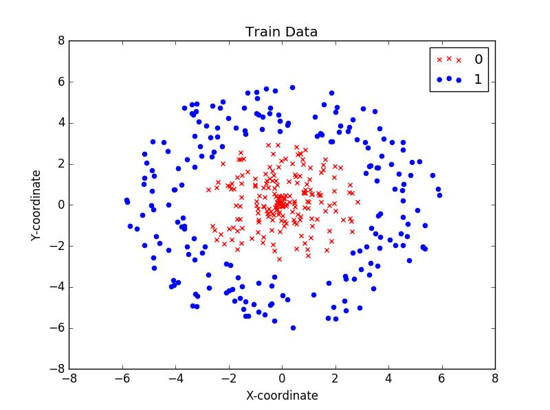
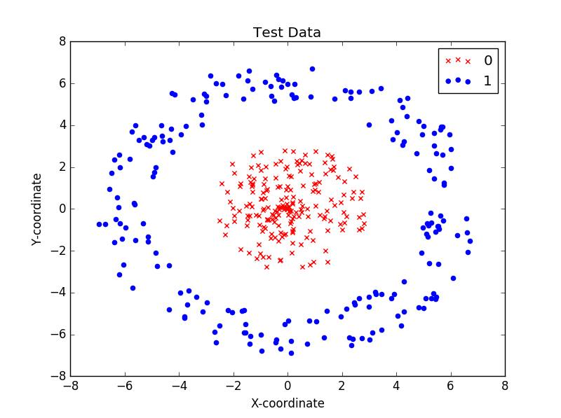

========
Tutorial
========

In this section, we will see how to use different functions and classes available in the *neuralNetworkClass*.

*neuralNetworkClass* offers 4  major submodules namely:
	- nn : contains the class *neural_network* which offers utilities to create a artificial neural network, train it and use it for prediction
	- node : contains the class *node* which provides methods to modify and activate the node. It also contains activation functions and it's derivatives
	- grad_descent : this is a full fledged non-linear optimazation algorithm based on gradient descent and backtracking line search method.
	- conjugate_gradient : conjugate gradient descent algorithm to optimize the cost function using Fletcher-Reeves Update   

Following code can be used for to import the library

.. code-block:: python
	:caption: how to import the class

	import neuralNetworkClass as nNC
	from nNC.conjugate_gradient import conjugate_gradient as cg
	from nNC.grad_descent import grad_descent as gd
	from nNC.node import node as nd
	from nNC.nn import nn

How to use optimization tools ?
===============================

Given a non-linear cost function of the form f(x) and initial value x0, the optimization functions returns the local optima.

In the following example we will show how to use both *grad_descent* and *conjugate_gradient* in simple function, read the docs to explore more options.

.. code-block:: python
	:caption: Using *conjugate_gradient*

	def func(x):
		return pow(x[0]-2,6.0)+pow(x[1]-3,6.0) + (x[0] - x[1])**2  
	x0 = [1,2]
	point_of_optima = cg(func,x0)		

.. code-block:: python
	:caption: Using *grad_descent*

	def func(x):
		return pow(x[0]-2,6.0)+pow(x[1]-3,6.0) + (x[0] - x[1])**2  
	x0 = [1,2]
	point_of_optima = gd(func,x0)

How to create and train the neural network ?
============================================

To illustrate the neural network class we try to solve binary classifying problem described using the following figure.

   

   
Data for the class is created using the following code  
	
.. code-block:: python
	:caption: Creating the data set

	import numpy as np
	import random

	# creating train data
	# to ensure radial symmetry
	r_in = np.random.uniform(0,3,50)
	theta_in = np.random.uniform(0,2*np.pi,50)
	r_out = np.random.uniform(3.5,6,50)
	theta_out = np.random.uniform(0,2*np.pi,50)
	# creating x and y co-ordinates
	x_in = r_in*np.cos(theta_in)
	y_in = r_in*np.sin(theta_in)
	x_out = r_out*np.cos(theta_out)
	y_out = r_out*np.sin(theta_out)
	# creating data
	inside = [[[x,y],[0,1]] for x,y in zip(x_in,y_in)]
	outside = [[[x,y],[1,0]] for x,y in zip(x_out,y_out)]
	consolidated_train_data = inside+outside
	random.shuffle(consolidated_train_data)
	train_data = [element[0] for element in consolidated_train_data]
	target_train = [element[1] for element in consolidated_train_data]

	# creating test data
	# to ensure radial symmetry
	r_in = np.random.uniform(0,3,20)
	theta_in = np.random.uniform(0,2*np.pi,20)
	r_out = np.random.uniform(5,7,20)
	theta_out = np.random.uniform(0,2*np.pi,20)
	# creating x and y co-ordinates
	x_in = r_in*np.cos(theta_in)
	y_in = r_in*np.sin(theta_in)
	x_out = r_out*np.cos(theta_out)
	y_out = r_out*np.sin(theta_out)
	# creating data
	inside = [[[x,y],[0,1]] for x,y in zip(x_in,y_in)]
	outside = [[[x,y],[1,0]] for x,y in zip(x_out,y_out)]
	consolidated_test_data = inside+outside
	random.shuffle(consolidated_test_data)
	test_data = [element[0] for element in consolidated_test_data]
	target_test = [element[1] for element in consolidated_test_data]

We will create a neural network with 1 hidden layer (with 4 units) and tanh as the activation function. Train the network using the data created above

.. code-block:: python
	:caption: Creating and training the neural network

	from neuralNetworkClass.nn import neural_network
	circle = neural_network([2,4,2], activation_func="tanh")
	circle.train(train_data, target_train)

We can check the code for accuracy by predicting and validating on the test data.

.. code-block:: python
	:caption: Predicton on test data

	num_examples = len(test_data)
	positive = 0
	for j in range(num_examples):
	    output = circle.predict(test_data[j])
	    if output == target_test[j]:
	        positive += 1
	accuracy = positive/num_examples
	print("Test accuracy : ", accuracy*100)